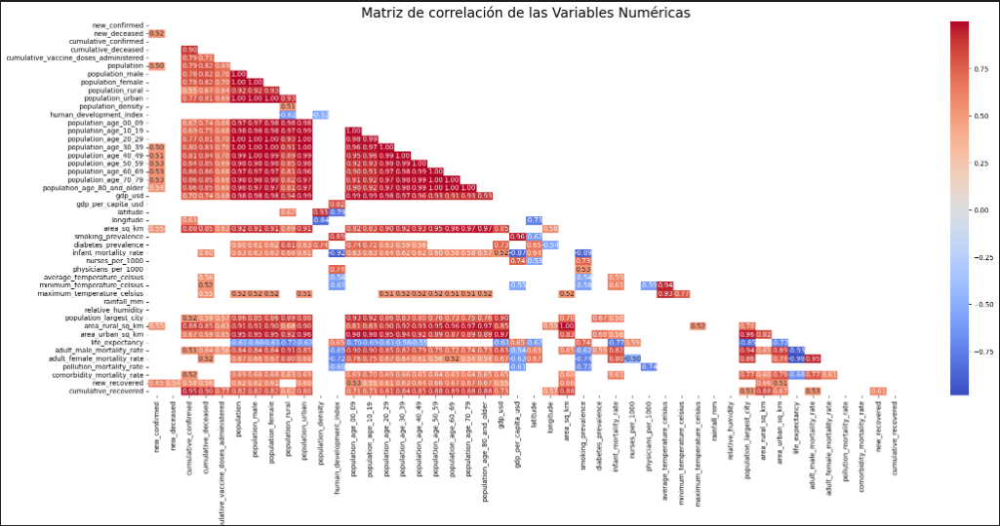
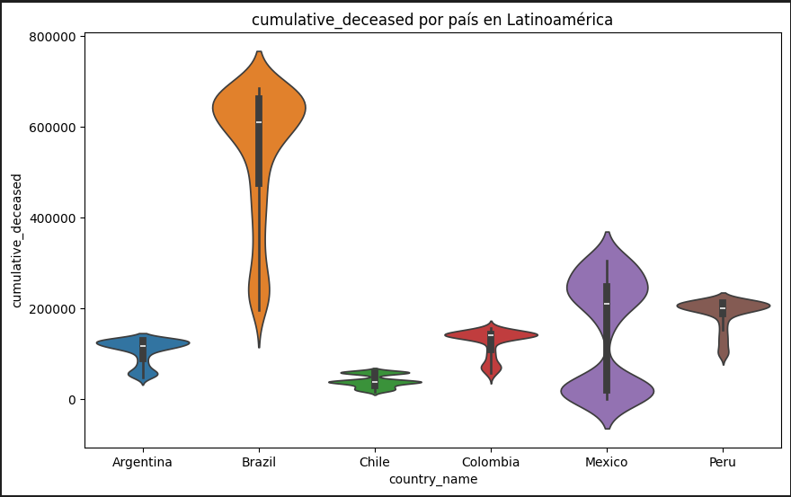
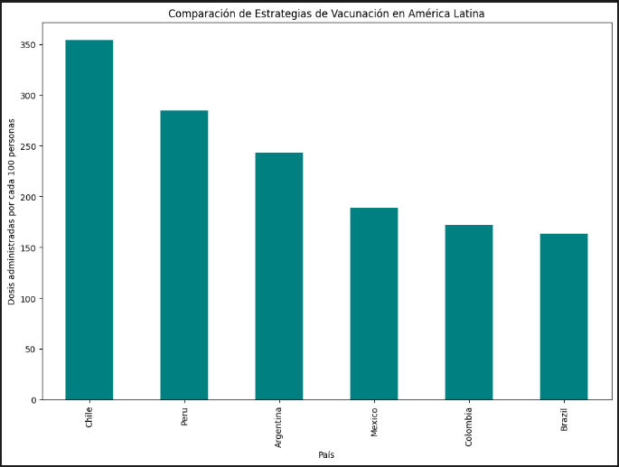
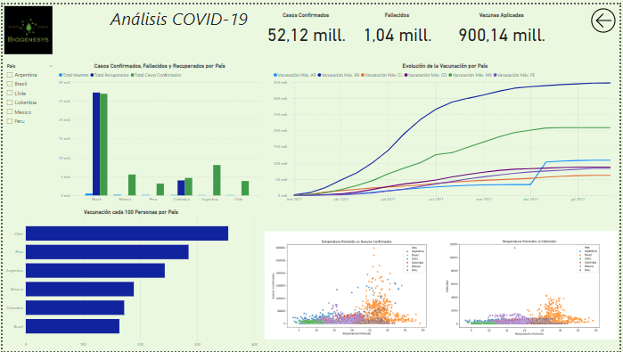
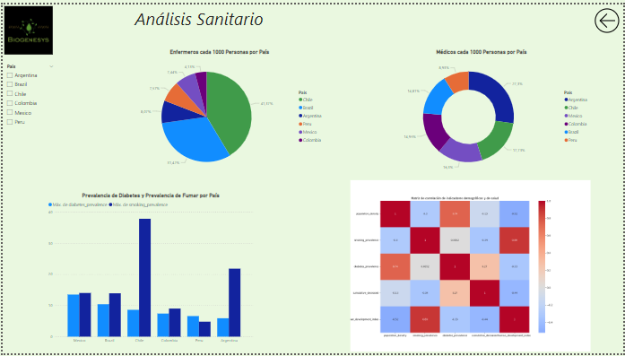
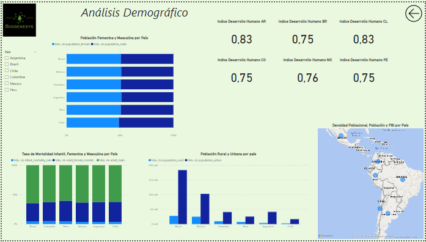
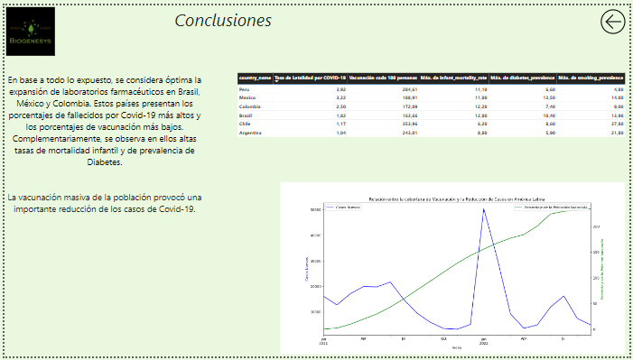
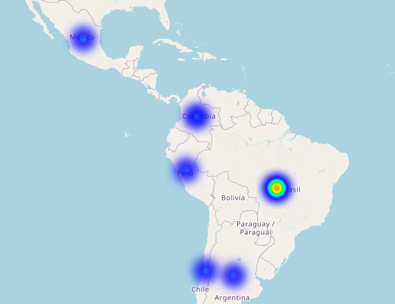

# BIOGENESYS

La empresa farmacéutica BIOGENESYS busca identificar las ubicaciones óptimas para la expansión estratégica de laboratorios farmacéuticos, basándose en el análisis de datos de incidencia de COVID-19, tasas de vacunación, y la disponibilidad de infraestructuras sanitarias. La meta es optimizar la respuesta a los efectos de la pandemia y postpandemia con el fin de mejorar el acceso a las vacunas.
Para llevar a cabo este proyecto, BIOGENESYS solicitó un estudio que ayude en su estrategia de expansión en Latinoamérica, concretamente en Colombia, Argentina, Chile, México, Perú y Brasil. Este análisis es esencial para que puedan estar a la altura de las necesidades y poder dar una rápida respuesta ante cualquier situación futura que pueda surgir. Con el fin de establecer las regiones más idóneas, se hará un exhaustivo análisis de los datos recolectados, que ayudará en la toma de decisiones informada y estratégica.

Para llevar a cabo el proyecto, se realizarán las siguientes acciones:
- Acceso a los datos mediante operaciones eficientes de extracción, transformación y carga (ETL), asegurando así la consistencia y confiabilidad de los mismos.
- Un análisis exploratorio de datos sobre la incidencia de COVID-19 y otros factores relevantes, identificando tendencias y oportunidades mediante estadísticas, mediciones y visualizaciones.
- Desarrollo de dashboards interactivos con visualizaciones eficientes, permitiendo explorar datos desde múltiples perspectivas.

### Desarrollo del proyecto

Se comenzó con un recorrido por el dataset para conocer la información general contenida en él. Luego, se siguió con el proceso de ETL, donde se realizaron dos filtros. Seleccionando los países y el rango de fecha solicitados para el análisis. 
En una segunda instancia, se realizó la limpieza de los datos. Se ubicaron todos los valores nulos y se los trató según diferentes criterios.
- Nuevos confirmados,  Nuevos decesos, Promedio temperatura, Máxima temperatura, Mínima temperatura, Lluvia_mm, Humedad: los valores faltantes se reemplazaron por el promedio correspondiente a cada país.
- Acumulado confirmados, Acumulado decesos, Acumulado vacunas administradas: fueron reemplazados los valores nulos por el valor anterior, ya que se trata de columnas de valores acumulados.
- Nuevos recuperados y Acumulado recuperados: los valores nulos fueron reemplazados por 0, ya que se observó que la mayoría de los datos cargados en ambas columnas eran 0.

En las columnas de Nuevos confirmados y Nuevos recuperados se encontraron algunos pocos valores negativos, que se los convirtió a su correspondiente  valor absoluto. 

Se realizaron funciones para obtener medidas estadísticas (Meidana, Varianza, Rango y Moda).

Se realizaron diferentes códigos de gráficos con ciclo for para automatizar la creación de las gráficas.
Gráficos realizados:
- Matriz de correlación: entre todas las variables numéricas. Entre variables demográficas y de salud.
- De Barras: países vs cada variable numérica. Distribución de la población por grupo etario. Tasa de mortalidad masculina y femenina por país.
- Histogramas: de cada variable numérica.
- De Dispersión: Nuevos confirmados y Muertes vs Promedio de temperatura por país.
- De Caja: temperatura promedio por país.
- De Línea: evolución de la vacunación por país a lo largo del tiempo.  Muertes, Nuevos confirmados y Recuperados por país a lo largo del tiempo. Comparación de nuevos casos en América Latina en el tiempo. Vacunación por grupo etario por país a lo largo del tiempo.
- De densidad: administración de vacunas por país.
- Violín: de cada variable numérica con variación en los valores.

### EDA e insights

Gráficos realizados:
- De línea: evolución semanal de los Nuevos confirmados por país. Nuevos confirmados y temperatura promedio a lo largo del tiempo. Relación entre cobertura de vacunación y reducción de casos nuevos en América Latina. Análisis temporal de mortalidad en América Latina.
- De Barras: progreso de vacunación por país. Impacto de la urbanización en la propagación del Covid-19. Distribución de la población de los países con altas tasas de mortalidad. Estrategia de vacunación por país. Tasa de letalidad por Covid-19 por país. Comparación de la situación actual entre países.

### Durante el proceso de análisis exploratorio se observó:

    - Brasil y Chile tienen la mayor cantidad de enfermeros.
    - Argentina y Chile tienen la mayor cantidad de médicos.
    - México, Brasil y Chile tienen los porcentajes más altos de prevalencia de Diabetes.
    - Existe una fuerte correlación positiva entre: la prevalencia de fumar y el índice de desarrollo humano (0.89), la prevalencia de diabetes y la densidad poblacional (0,74).
    - México y Colombia son los países más densamente poblados.
    - Argentina y Chile cuentan con el índice de desarrollo humano más alto.
    - La mortalidad masculina duplica a la femenina en todos los países.
    - México, Colombia, Brasil y Perú tienen las tasas de mortalidad infantil más altas.
    - México tiene un alto número de habitantes rurales.
    - Brasil, México, Colombia y Argentina tienen mayor número de casos confirmados.
    - Brasil, México, Colombia son los países que menos dosis de vacunas aplicaron.
    - Brasil es el país con mayor número de fallecidos.

### Análisis del dashboard

El dashboard se compone por cinco hojas: Portada, tres reportes y conclusiones.

- Dashboard: portada.
    1. logo de la empresa
    2. título
    3. botones interactivos de navegación.

- Covid-19: primer reporte.
    1. título
    2. segmentador por país
    3. botón interactivo de regresar a la portada
    4. tarjetas: Total de Confirmados. Total de Muertes. Total de Vacunas Aplicadas 
    5. gráficos de: Casos nuevos, Fallecidos y Recuperados por país. Evolución de vacunación por país a lo largo del tiempo. Vacunación cada 100 personas por país.
    6. gráficos de Python: Temperatura promedio vs Nuevos confirmados por país. Temperatura promedio vs Muerte por país.

- Salud: segundo reporte.
    1. título
    2. segmentador por país
    3. botón interactivo de regresar a la portada
    4. gráficos: Enfermeros cada 1000 personas por país. Médicos cada 1000 personas por país. Prevalencia de diabetes y de fumar por país. 
    5. gráfico de Python: Matriz de correlación entre variables demográficas y de salud.

- Demografía: tercer reporte.
    1. título
    2. segmentador por país
    3. botón interactivo de regresar a la portada
    4. tarjetas: IDH de cada país
    5. gráficos: Población femenina y masculina por país. Tasas de mortalidad infantil, femenina y masculina por país. Población rural y urbana por país. 
    6. Mapa con Información de población, densidad poblacional y PBI de cada país

- Conclusiones: conclusiones
    1. título
    2. botón interactivo de regresar a la portada
    3. gráfico de Python: Relación de la vacunación y la reducción de casos
    4. tabla de insights
    5. conclusiones finales

Se colocan algunos gráficos de Python solo para graficar algunos resultados pero son solo ilustrativos, no interactivos.

### Conclusiones

En base a todo lo expuesto, se considera óptima la expansión de laboratorios farmacéuticos en Brasil, México y Colombia. Estos países presentan los porcentajes de fallecidos por Covid-19 más altos y los porcentajes de vacunación más bajos. Complementariamente, se observa en ellos altas tasas de mortalidad infantil y de prevalencia de Diabetes.

### Extra credit

- Se creó en Jupyter Notebook, mapa con Folium.
- Se utilizaron markdowns para registrar análisis preliminares entre gráficos.
- Se utilizó la función de orden superior Apply() con función Lambda para convertir los valores negativos a su valor absoluto.

